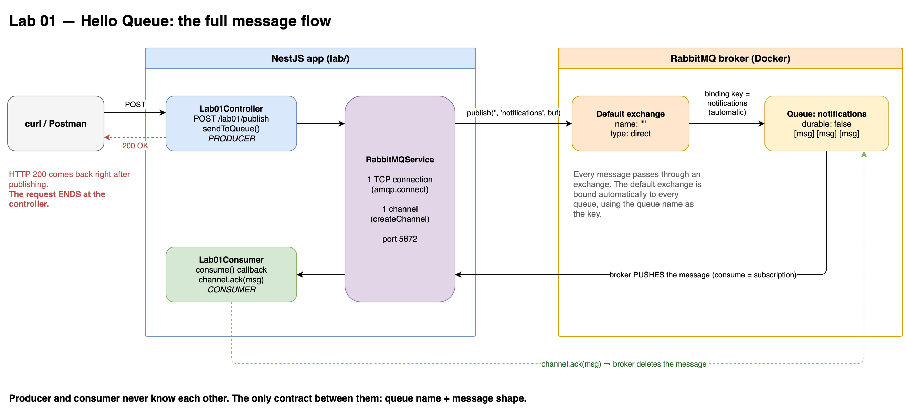
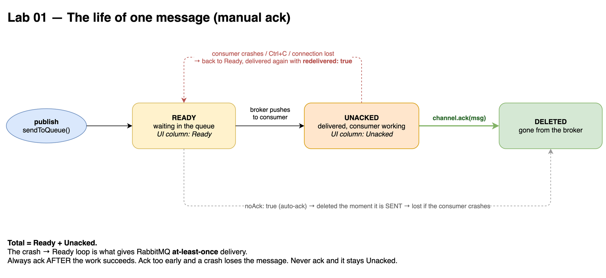

# Lab 01 — Hello Queue

## Goal
Publish a message from an HTTP endpoint and consume it independently.

## Flow
```text
POST /lab01/publish
      │
      ▼
Lab01Controller ──sendToQueue──► [ default exchange "" ] ──► notifications ──► Lab01Consumer
```

## Run
```bash
# 1. Producer only — messages pile up (watch Ready in the UI)
npm run start:dev
curl -X POST http://localhost:3000/lab01/publish \
  -H 'Content-Type: application/json' -d '{"userId": 10}'

# 2. With consumer — backlog drains
CONSUMERS=on npm run start:dev
```

## Key Takeaways
- The HTTP request **ends at the controller**. What reaches the consumer is a **message**, not the request.
- Producer and consumer never know each other. The contract is **queue name + message shape**.
- `sendToQueue(q, buf)` === `publish('', q, buf)`. Every message passes through an exchange — here the **default exchange**.
- **One connection per process** (expensive). All work happens on **channels** (cheap).
- `assertQueue` is idempotent, but throws `PRECONDITION_FAILED` if the queue exists with different options.
- `consume` registers a **push subscription**. It does not read a message.
- The body is raw bytes → `Buffer.from(JSON.stringify(...))`. RabbitMQ ignores the format.
- `sendToQueue` returning `true` ≠ broker received it. Only **publisher confirms** prove that (Lab 11).

## ACK Lifecycle
```text
Ready ──deliver──► Unacked ──ack──► deleted
                      │
                      └── consumer dies ──► back to Ready (redelivered)
```
- `noAck: false` = manual ack. Always ack **after** the work succeeds.

## Mental Model
RabbitMQ is a post office, not a phone call:
it takes ownership of the message, so the receiver does not need to be alive when you send.

## Diagrams


