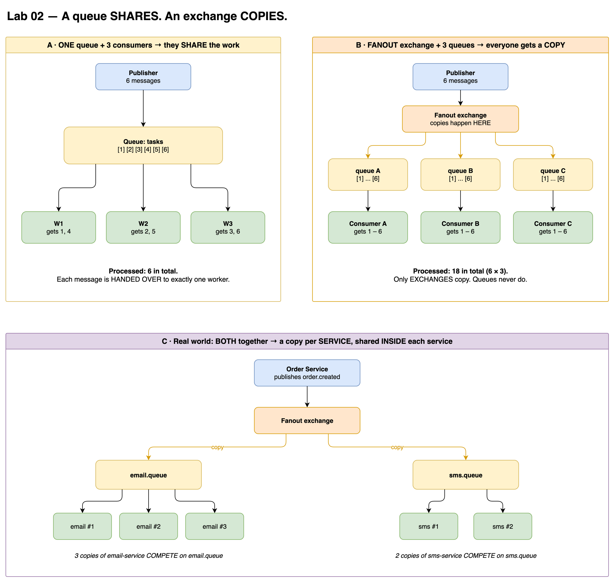
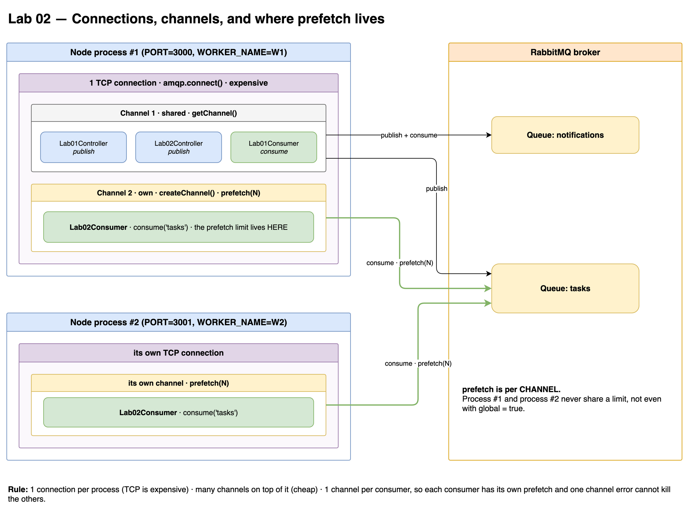

# Lab 02 — Work Queue (Competing Consumers + Prefetch)

## Goal
Spread tasks from one queue across several workers, and control how many each worker holds.

## Flow
```text
                              ┌──► W1
POST /lab02/publish ──► tasks ┤
                              └──► W2
```

## Run
```bash
CONSUMERS=on WORKER_NAME=W1 WORKER_DELAY=100  PREFETCH=1 PORT=3000 npm run start
CONSUMERS=on WORKER_NAME=W2 WORKER_DELAY=3000 PREFETCH=1 PORT=3001 npm run start

curl -X POST http://localhost:3000/lab02/publish \
  -H 'Content-Type: application/json' -d '{"count": 20}'
```

| Env            | Meaning                                       |
|----------------|-----------------------------------------------|
| `WORKER_NAME`  | Label shown in logs                           |
| `WORKER_DELAY` | Simulated work time (ms)                      |
| `PREFETCH`     | Max unacked messages per consumer (`0` = ∞)   |

## Key Takeaways
- **A queue never copies messages.** N consumers on one queue **share** the work; each message goes to exactly one.
- Only **exchanges** make copies. Need a copy per service → one queue per service (Lab 3).
- `channel.prefetch(N)` = "never send me more than N unacked messages".
- `prefetch` is **per channel** → every consumer gets its own channel via `createChannel()`.
- **In Node, prefetch = max concurrency**, because amqplib never awaits the consume callback.
- `prefetch = 0` → blind round-robin; a slow or stuck worker hoards messages, and new workers get nothing.
- `prefetch = 1` → work flows to whoever is free.
- Max `Unacked` = `consumers × prefetch`. Everything else stays `Ready` in the broker.
- Throughput ≈ `consumers × prefetch × (1000 / delayMs)` msg/s.
- A worker dying mid-task → message returns to `Ready` with `redelivered: true` → **at-least-once** (Lab 12).

## Gotchas
- **No ack + prefetch N** → consumer silently freezes after N messages. No error.
  Signature: `Ready` grows, `Unacked` stuck at `consumers × prefetch`.
- An exception thrown before `ack` has the same effect (fixed with try/catch + nack in Lab 7).
- `prefetch()` only affects consumers created **after** it → call it before `consume()`.
- `global = true` shares the limit across consumers **on the same channel only** — never across processes.
- Broker closes channels holding an unacked message longer than `consumer_timeout` (default 30 min).

## Mental Model
```text
Exchange = photocopier   → one copy per bound queue
Queue    = ticket stack  → each ticket is taken by one worker
Prefetch = how many tickets one worker may hold at a time
```

## Diagrams



