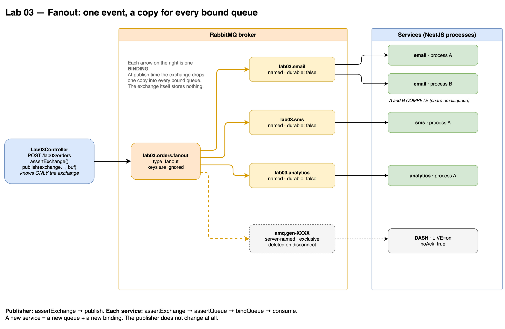
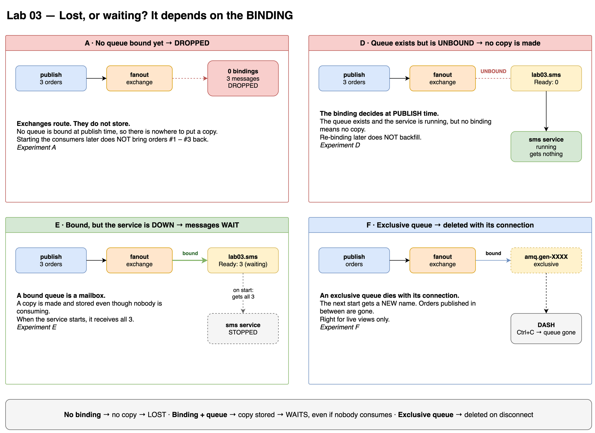
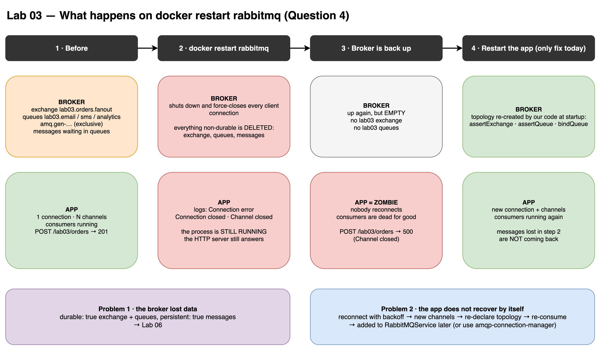
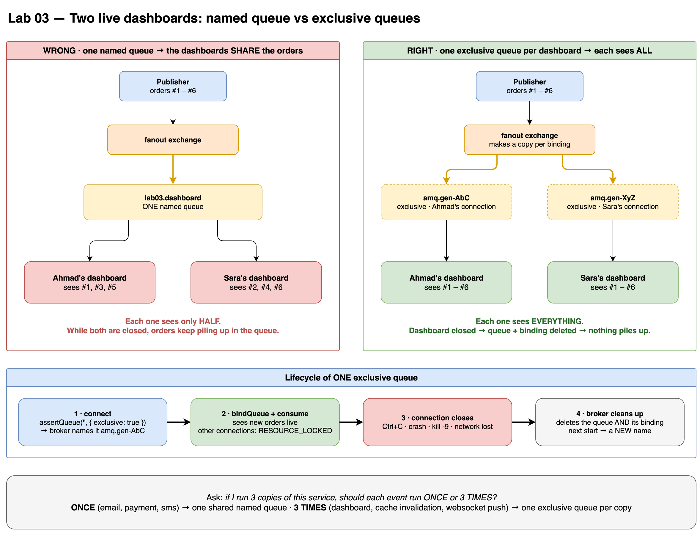

# Lab 03 — Fanout Exchange

## Goal
Broadcast one event to several services. Every service gets its own copy.

## Flow
```text
                                 ┌──► lab03.email      ──► email service(s)
POST /lab03/orders ──► fanout ───┼──► lab03.sms        ──► sms service(s)
                                 └──► lab03.analytics  ──► analytics service(s)
```

## Run
```bash
CONSUMERS=on WORKER_NAME=A SERVICES=email,sms,analytics PORT=3000 npm run start
CONSUMERS=on WORKER_NAME=B SERVICES=email PORT=3001 npm run start
CONSUMERS=on WORKER_NAME=DASH SERVICES=none LIVE=on PORT=3002 npm run start

curl -X POST http://localhost:3000/lab03/orders \
  -H 'Content-Type: application/json' -d '{"count": 6}'
```

| Env        | Meaning                                                  |
|------------|----------------------------------------------------------|
| `SERVICES` | `email,sms,analytics` subset · `none` · unset = all      |
| `LIVE`     | `on` = start a temporary exclusive subscriber             |

## Key Takeaways
- The publisher knows **only the exchange**. Each service declares **its own queue + binding**.
- Adding a service = new queue + binding. **Zero publisher changes.**
- `publish(exchange, routingKey, buf)` replaces `sendToQueue`.
- Fanout **ignores** routing keys and binding keys.
- **An exchange stores nothing.** No bound queue at publish time → message silently dropped.
- Bindings decide copies **at publish time**. No backfill after re-binding.
- Service down but queue bound → messages wait. Queue unbound → messages lost.
- Copy per service (exchange) + share inside a service (competing consumers) work together.
- Both sides call `assertExchange` so startup order does not matter.

## Named vs Exclusive Queue
| | `lab03.email` | `amq.gen-…` (`''`, `exclusive: true`) |
|---|---|---|
| Survives consumer shutdown | ✅ keeps collecting | ❌ deleted immediately |
| Use for | real services | live dashboards, debugging |

## Gotchas
- `durable: false` queues survive app restarts; only a **broker** restart removes them.
- Binding to a non-existent exchange → `NOT_FOUND` → channel closed.
- Our `RabbitMQService` has **no reconnect** logic yet: a broker restart leaves the app disconnected.

## Mental Model
```text
Exchange = photocopier with a distribution list (the bindings)
Binding  = your name on that list
Queue    = your personal mailbox
```

## Diagrams





