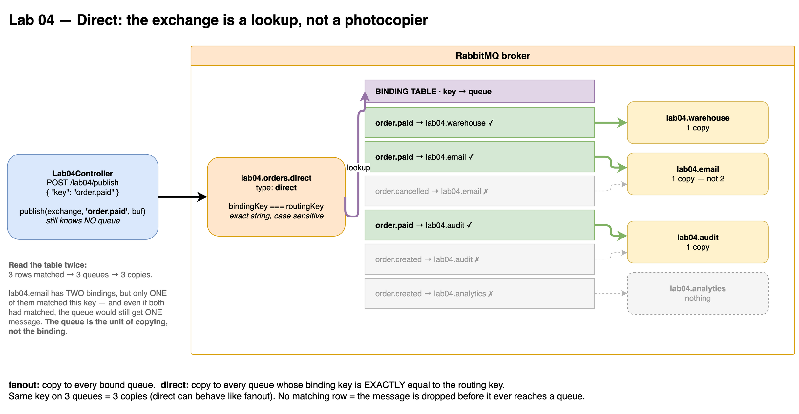
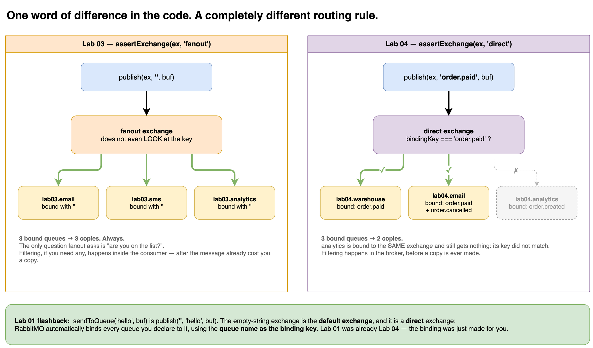
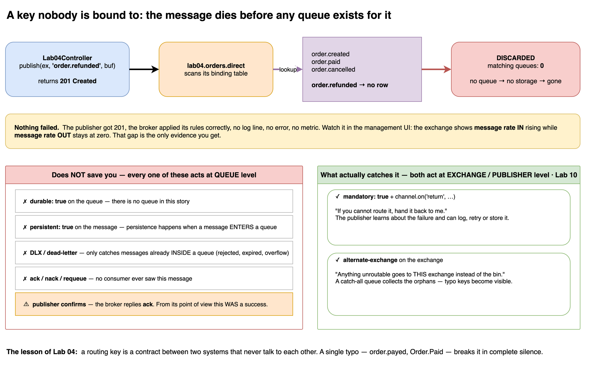

# Lab 04 — Direct Exchange

## Goal
Route one event to the right **subset** of services, using a **routing key**.
Fanout asks "are you bound?". Direct asks "is your binding key **exactly** this string?".

## Flow
```text
                                        binding key
POST /lab04/publish                      order.paid      ──► lab04.warehouse
  { "key": "order.paid" }                order.paid      ──► lab04.email
        │                                order.paid      ──► lab04.audit
        ▼                                order.cancelled ──► lab04.email
   direct exchange ── lookup ──►         order.created   ──► lab04.audit
   lab04.orders.direct                   order.created   ──► lab04.analytics
```

## Subscriptions
| service | queue | binding keys |
|---------|-------|--------------|
| `warehouse` | `lab04.warehouse` | `order.paid` |
| `email` | `lab04.email` | `order.paid` · `order.cancelled` |
| `audit` | `lab04.audit` | all three |
| `analytics` | `lab04.analytics` | `order.created` |

## Run
```bash
CONSUMERS=on WORKER_NAME=ALL PORT=3000 npm run start:dev

curl -X POST http://localhost:3000/lab04/publish \
  -H 'Content-Type: application/json' -d '{"key": "order.paid"}'
```

| Env | Meaning |
|-----|---------|
| `LAB04_SERVICES` | `warehouse,email,audit,analytics` subset · `none` · unset = all |

Its own env var on purpose: Lab 03 already owns `SERVICES`.

## Experiments
| # | Publish | Expected |
|---|---------|----------|
| A | `order.paid` | `warehouse` + `email` + `audit` — one key, three queues |
| B | `order.created` | `audit` + `analytics` |
| C | `order.cancelled` | `email` + `audit` — same queue, a different binding |
| D | `order.refunded` | **nothing** — watch rate IN rise and rate OUT stay at 0 |
| E | `Order.Paid` | **nothing** — matching is case sensitive |
| F | two processes running `warehouse` | the 10 messages are **shared**, Lab 02 still applies |

## Key Takeaways
- Direct matching is **exact string equality** — no prefix, no regex, **case sensitive**.
- One queue can hold **many bindings**. Two bindings matching the same message still deliver **one** copy: the **queue** is the unit of copying, not the binding.
- `bindQueue` is **idempotent**. Bindings are a set keyed by `(exchange, queue, key, args)`, so re-binding on every restart is safe.
- Many queues on the **same** key → many copies. Direct can behave exactly like fanout.
- `msg.fields.routingKey` tells the consumer which key arrived — RabbitMQ never says *which binding* matched.
- Adding a service is still **zero publisher changes**: a new queue plus its own bindings.
- The **default exchange** (Lab 01) is a direct exchange; RabbitMQ auto-binds every queue to it with the **queue name as the binding key**.

## Gotchas
- **A key nobody is bound to is dropped silently.** The `POST` still returns 201.
- Nothing at queue level saves it: `durable`, `persistent`, DLX and `nack` all act on messages **already inside a queue**. Publisher confirms even reply **ack** — the broker considers it a success.
- The only cures act on the exchange / publisher side: `mandatory` + `basic.return`, or an alternate exchange. → **Lab 10**.
- An exchange's **type cannot be changed** after creation. Re-declaring `lab04.orders.direct` as `fanout` → `PRECONDITION_FAILED`, channel closed.
- One key per service scales badly: 200 event types means 200 `bindQueue` calls for an audit service. → **Lab 05 (topic)**.

## Mental Model
```text
fanout exchange = photocopier with a mailing list
direct exchange = post office sorting by exact address label
routing key     = the address written on the envelope
binding key     = the address written on your mailbox
```

## Diagrams



