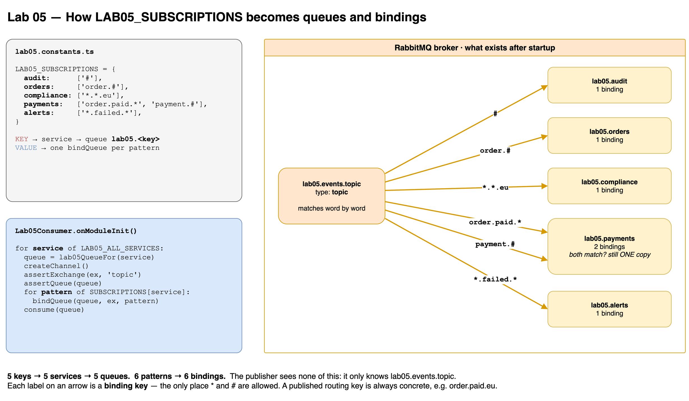
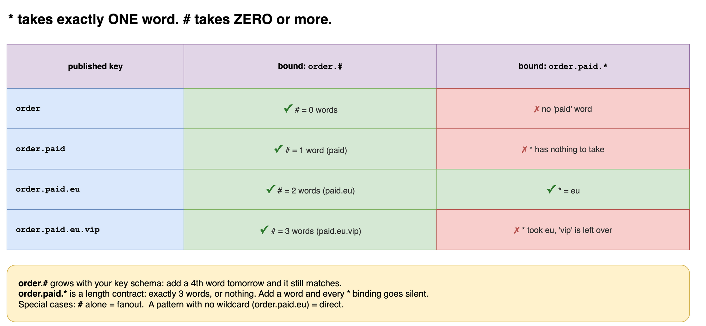

# Lab 05 — Topic Exchange

## Goal
Let each service subscribe to a **pattern** of events instead of a list of exact keys.
Fanout asks "are you bound?". Direct asks "is your key exactly this?". Topic asks "does your key match this pattern, word by word?".

## Wildcards
```text
routing key  order.paid.eu   →  words: [order] [paid] [eu]

*   exactly ONE word    (the word must exist)
#   ZERO or more words  (may match nothing at all)
```
The dot only means something in a **topic** exchange. Wildcards are only allowed in **binding keys**. The publisher always sends a concrete key.

## Flow
```text
                                                binding key
POST /lab05/publish                      #              ──► lab05.audit
  { "key": "order.paid.eu" }             order.#        ──► lab05.orders
        │                                *.*.eu         ──► lab05.compliance
        ▼                                order.paid.*   ──► lab05.payments
   topic exchange ── match ──►           payment.#      ──► lab05.payments
   lab05.events.topic                    *.failed.*     ──► lab05.alerts
```

## Where the queues come from
`LAB05_SUBSCRIPTIONS` is the single source of truth:

```ts
LAB05_SUBSCRIPTIONS = {
  audit:      ['#'],
  orders:     ['order.#'],
  compliance: ['*.*.eu'],
  payments:   ['order.paid.*', 'payment.#'],
  alerts:     ['*.failed.*'],
}
```

| Part of the object | Becomes |
|--------------------|---------|
| each **key** (`audit`, `orders`, …) | one service → one queue named `lab05.<key>` via `lab05QueueFor()` |
| each **value** (array) | one `bindQueue(queue, exchange, pattern)` per pattern |

5 keys → **5 queues**. 6 patterns → **6 bindings**. Adding a service = adding one line here.

## Run
```bash
CONSUMERS=on WORKER_NAME=ALL PORT=3000 npm run start:dev

curl -X POST http://localhost:3000/lab05/publish \
  -H 'Content-Type: application/json' -d '{"key": "order.paid.eu"}'
```

| Env | Meaning |
|-----|---------|
| `LAB05_SERVICES` | `audit,orders,compliance,payments,alerts` subset · `none` · unset = all |

## Experiments
| # | Publish | Reaches | Lesson |
|---|---------|---------|--------|
| A | `order.paid.eu` | audit · orders · compliance · payments | every slot filled |
| B | `order.paid.us` | audit · orders · payments | `us` ≠ `eu` |
| C | `payment.failed.us` | audit · payments · alerts | two different patterns hit |
| D | `order` | audit · orders | `#` matched **zero** words |
| E | `order.paid` | audit · orders | `*` needs a 3rd word → **payments misses it** |
| F | `order.paid.eu.vip` | audit · orders | 4 words break every `*` pattern |
| G | `user.registered.eu` | audit · compliance | patterns cut across domains |

## Key Takeaways
- `*` = exactly one word. `#` = zero or more. `order.#` matches `order` itself.
- `*` patterns are a **length contract**: add a word to your keys and they go silent. `#` patterns survive schema growth.
- `#` alone behaves like **fanout**. A pattern with no wildcard behaves like **direct**. Topic covers both.
- Same rule as Lab 04: a queue whose bindings match twice still gets **one** copy.
- The consumer only sees `msg.fields.routingKey`, never which pattern matched.
- The **subscriber** decides what it wants through its bindings. The publisher is unchanged.
- Pick the simplest exchange that solves the problem. Direct is a hash lookup; topic walks a trie. The difference only shows at high rates with many bindings.

## Gotchas
- `order.#` is broad: it also receives every **future** `order.*` event someone adds, including ones with a different payload shape. Validate the payload, or use a tighter pattern.
- A mismatched word count fails **silently**, exactly like an unbound key in Lab 04. → Lab 10.
- Matching is still case sensitive: `Order.Paid.EU` reaches only `audit` (`#`).
- Keep one key convention for the whole system (`<entity>.<action>.<region>`). Mixing orders breaks every `*` binding.

## Mental Model
```text
routing key = a sentence split into words by dots
binding     = a sentence template
*           = fill in exactly one word
#           = fill in any number of words, or none
```

## Diagrams



