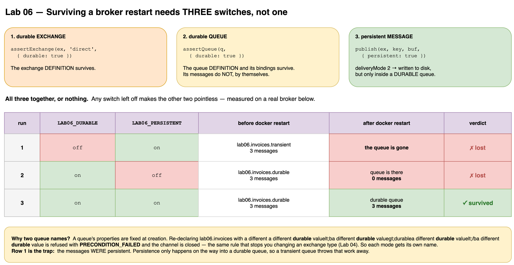
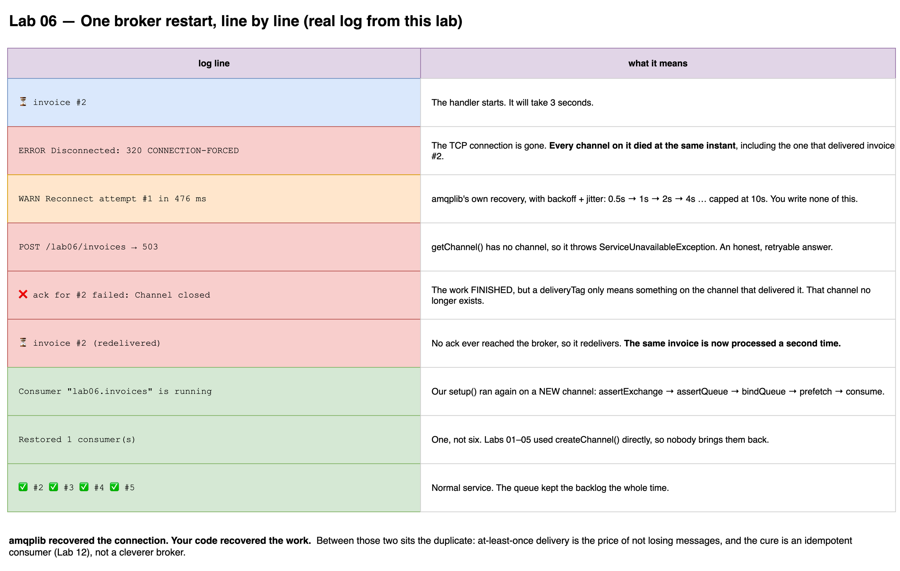

# Lab 06 — Durability & Reconnect

## Goal
Answer two different questions that are easy to confuse:

1. **The broker restarted — did the messages survive?** → durability
2. **The broker came back — did my app come back?** → reconnect

## Part 1 — The three switches

```text
durable EXCHANGE   assertExchange(ex, 'direct', { durable: true })   the exchange definition survives
durable QUEUE      assertQueue(q, { durable: true })                 the queue + its bindings survive
persistent MESSAGE publish(ex, key, buf, { persistent: true })       deliveryMode 2, written to disk
```

All three, or nothing. Measured on a real broker:

| run | `LAB06_DURABLE` | `LAB06_PERSISTENT` | before restart | after restart | verdict |
|-----|-----------------|--------------------|----------------|---------------|---------|
| 1 | `off` | `on` | transient queue · 3 msgs | **queue gone** | ✗ lost |
| 2 | `on` | `off` | durable queue · 3 msgs | queue there · **0 msgs** | ✗ lost |
| 3 | `on` | `on` | durable queue · 3 msgs | durable queue · **3 msgs** | ✓ survived |

Run 1 is the trap: the messages *were* persistent. Persistence only happens on the way **into a durable queue**.

## Part 2 — What recovers, and what does not

`amqplib` 2.x reconnects by itself when you pass `recovery`:

```ts
await amqp.connect(url, {
  recovery: { initialDelay: 500, maxDelay: 10_000, factor: 2 },
});
```

| layer | who restores it |
|-------|-----------------|
| TCP connection | ✅ amqplib, with backoff + jitter |
| channels | ❌ you |
| consumers | ❌ you |
| exchanges, queues, bindings | ❌ you |

That is what `RabbitMQService.registerConsumer(name, setup)` is for: the service stores every `setup` function and re-runs it on a **fresh channel** after each reconnect.

```ts
await this.rabbit.registerConsumer('lab06.invoices', (channel) => this.setup(channel));
```

`setup()` must declare **everything** — exchange, queue, binding, prefetch, consume — because after a restart none of it is guaranteed to exist.

## Run
```bash
# Part 1: declare the topology, collect messages, consume nothing
CONSUMERS=on LAB06_PAUSED=on LAB06_DURABLE=off LAB06_PERSISTENT=on npm run start:dev

# Part 2: full consumer, slow enough to be interrupted
CONSUMERS=on LAB06_DELAY=3000 npm run start:dev

curl -X POST http://localhost:3000/lab06/invoices \
  -H 'Content-Type: application/json' -d '{"count":5}'
```

| Env | Default | Meaning |
|-----|---------|---------|
| `LAB06_DURABLE` | `on` | durable exchange + queue (also picks the queue name) |
| `LAB06_PERSISTENT` | `on` | `deliveryMode 2` on every message |
| `LAB06_PAUSED` | off | `on` = declare and bind, but never consume |
| `LAB06_DELAY` | `2000` | simulated work time in ms |

For Part 1, stop the app **before** `docker restart rabbitmq`: otherwise the reconnect re-declares the queue and you see an empty queue instead of a missing one.

## One restart, line by line
```text
⏳ invoice #2
ERROR Disconnected: 320 (CONNECTION-FORCED)
WARN  Reconnect attempt #1 in 476 ms          ← amqplib: 0.5s → 1s → 2s → 4s … capped at 10s
POST /lab06/invoices → 503                     ← getChannel() has no channel
WARN  ❌ ack for #2 failed: Channel closed      ← work finished, the delivering channel is dead
⏳ invoice #2  (redelivered)                    ← same invoice, SECOND time
Consumer "lab06.invoices" is running           ← setup() re-ran on a new channel
Restored 1 consumer(s)                         ← one, not six
✅ #2  ✅ #3  ✅ #4  ✅ #5
```

## Key Takeaways
- Durability is three switches. Any one of them off makes the other two pointless.
- A `deliveryTag` is only valid on the channel that delivered the message. Wrap `ack` in `try/catch`, or a reconnect turns into an unhandled rejection.
- No ack ever reached the broker → it redelivers → **the same work runs twice**. At-least-once is the price of not losing messages; the cure is an idempotent consumer (Lab 12).
- Return **503**, not 500, while the broker is down: the caller's request was fine, and 503 means "retryable".
- Never buffer messages in process memory during an outage. That is an in-app broker with no persistence, no limit and no ack. Use a transactional outbox in your database instead.
- Labs 01–05 still use `createChannel()` directly, on purpose: after a restart they publish fine but their consumers never come back. Compare `notifications` (0 consumers) with `lab06.invoices.durable` (1 consumer).

## Gotchas
- Queue properties are fixed at creation. Re-declaring a queue with a different `durable` value → **PRECONDITION_FAILED**, channel closed. That is why each mode uses its own queue name.
- **Durable queue + transient exchange** is the silent killer: after a restart the queue and its messages are there, but the exchange and the binding are gone. The publisher's `assertExchange` recreates an exchange with an *empty* binding table, so new messages are dropped, with a 201 each time. Only the consumer's `bindQueue` repairs it.
- `channel.publish()` does not wait for the broker, and `persistent` does not mean "flushed to disk right now". A 201 is not proof the broker has the message. → **Lab 11** (publisher confirms).
- `docker restart rabbitmq` wipes every `durable: false` queue from Labs 01–05. Expected.

## Mental Model
```text
durable      = the DEFINITION survives a broker restart   (exchange, queue, binding)
persistent   = the MESSAGE survives a broker restart      (only inside a durable queue)
recovery     = the CONNECTION comes back                  (amqplib)
registerConsumer = the WORK comes back                    (your code)
```

## Diagrams



