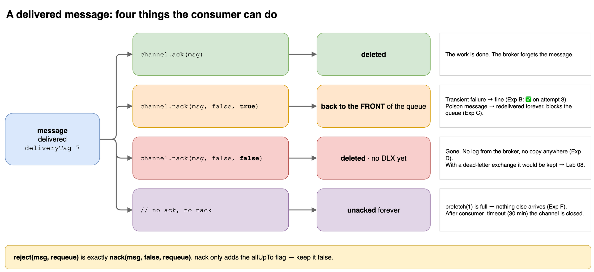
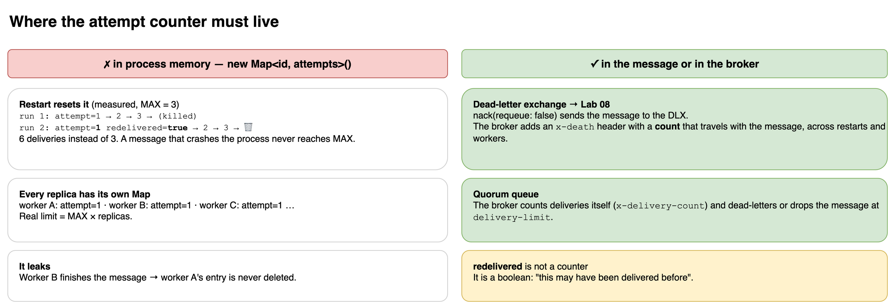

# Lab 07 — Ack / Nack / Reject

## Goal
Every lab so far ended the same way: the work succeeded and the consumer called `ack`.
This lab asks the harder question: **what should a consumer do when the work fails?**

RabbitMQ cannot tell a *transient* failure (retry it and it works) from a *poison* message (it will never work). The consumer has to decide, and every choice has a price.

## The four outcomes

```ts
channel.ack(msg);                  // done → the broker deletes it
channel.nack(msg, false, true);    // failed → back into the queue, at the FRONT
channel.nack(msg, false, false);   // failed → dropped (or dead-lettered, if the queue has a DLX)
// nothing                          // unacked forever → the consumer silently stalls
```

`channel.reject(msg, requeue)` is exactly `channel.nack(msg, false, requeue)`. `nack` only adds the `allUpTo` flag.

| call | where the message goes | risk |
|------|------------------------|------|
| `ack` | deleted | none (if the work really finished) |
| `nack(requeue: true)` | back to its **original position**, the front of the queue | poison message → infinite loop + blocks everything behind it |
| `nack(requeue: false)` | **deleted**. No DLX yet, so no trace | silent data loss |
| no ack, no nack | stays `unacked` on this channel | with `prefetch(1)`, nothing else is delivered. After `consumer_timeout` (30 min default) the channel is closed and the message is requeued |

## Flow
```text
POST /lab07/pay                     direct exchange                    queue
  { "kind": "poison" }   ──►   lab07.billing  ──payment.requested──►  lab07.payments
                                                                          │ prefetch(1)
                                                                          ▼
                                                              Lab07Consumer.handle()
                                                        ok ──► ack
                                                        fail ─► LAB07_STRATEGY decides
```

| `kind` | behaviour |
|--------|-----------|
| `ok` | succeeds on the 1st delivery |
| `transient` | fails twice, succeeds on the 3rd (network blip, lock timeout) |
| `poison` | never succeeds (malformed payload, a bug, a deleted account) |

## Run
```bash
CONSUMERS=on LAB07_STRATEGY=requeue npm run start:dev

curl -X POST http://localhost:3000/lab07/pay \
  -H 'Content-Type: application/json' -d '{"kind":"poison","count":1}'
```

| Env | Default | Meaning |
|-----|---------|---------|
| `LAB07_STRATEGY` | `requeue` | `requeue` · `drop` · `smart` · `hang` |
| `LAB07_MAX_ATTEMPTS` | `3` | `smart` only: deliveries before giving up |
| `LAB07_DELAY` | `500` | simulated work time in ms |

## Experiments (measured on a real broker)

| # | strategy | publish | result | queue after |
|---|----------|---------|--------|-------------|
| A | `requeue` | `ok` | `attempt=1` → ✅ | empty |
| B | `requeue` | `transient` | ↩️ ↩️ ✅ on attempt 3 | empty |
| C | `requeue` | `poison` + 3 × `ok` | #1 redelivered forever, the 3 `ok` **never run** | Ready **3** · Unacked **1** |
| D | `drop` | `poison` + 2 × `ok` | 🗑️ #1 dropped, #2 #3 ✅ | empty. #1 is **gone** |
| E | `smart` | `poison` + 2 × `ok` | ↩️ 1/3 · ↩️ 2/3 · 🗑️ gave up · #2 #3 ✅ | empty |
| F | `hang` | `poison` + 2 × `ok` | 💀 #1 left unacked, nothing else runs | Ready **2** · Unacked **1** |

### Experiment C, line by line
```text
#1 poison    attempt=1 redelivered=false
↩️  #1 requeued                               ← back to the FRONT of the queue
#1 poison    attempt=2 redelivered=true       ← the slot is free, the front is #1 again
↩️  #1 requeued
…
#1 poison    attempt=12 redelivered=true      ← #2, #3, #4 are still waiting
```

This is **head-of-line blocking**. It needs both ingredients:

1. `requeue: true` puts the message back at the **front**.
2. `prefetch(1)` means the consumer only ever takes the front message.

The same test with `prefetch(10)`: #2, #3 and #4 were delivered alongside #1 and finished. #1 kept looping by itself. The loop is still there, it just stops blocking the rest.

With `LAB07_DELAY=0` the loop ran **1,475 times in 3 seconds**, burning one CPU core.

### Why the in-memory counter fails
`smart` keeps attempts in a `Map` inside the process. Kill the app after attempt 3 and start it again:

```text
run 1:  attempt=1 → attempt=2 → attempt=3 → (killed)
run 2:  attempt=1 redelivered=true → attempt=2 → attempt=3 → 🗑️ gave up
```

The broker says `redelivered=true`, the counter says `1`. The poison message was delivered **6 times**, not 3. Two more ways it breaks:

- **Several workers:** each replica has its own `Map`, so the real limit becomes `MAX × replicas`.
- **Memory leak:** if another worker finishes the message, this worker's entry is never deleted.

The count has to live **in the message or in the broker**:
- DLX adds an `x-death` header that counts every dead-lettering → **Lab 08**.
- Quorum queues count deliveries themselves (`x-delivery-count` header) and stop at `delivery-limit`.

## Key Takeaways
- `nack(requeue: true)` is only safe for failures that go away on their own. For a poison message it is an infinite loop.
- A requeued message goes back to the **front**, not the back. With `prefetch(1)` one bad message blocks the whole queue: no error, no crash, the queue depth just stops moving.
- `nack(requeue: false)` without a dead-letter exchange **deletes** the message. Nothing is logged by the broker.
- Forgetting to ack is the quietest failure of all. The app looks healthy, Unacked stays at 1, and the symptom shows up 30 minutes later when `consumer_timeout` kills the channel.
- `redelivered` is a boolean ("this may have been delivered before"), not a count. AMQP 0-9-1 has no attempt counter.
- Retry decisions need state that survives restarts and is shared between workers. Process memory is neither.

## Gotchas
- **`allUpTo: true`** nacks or acks **every** unacked message on this channel up to that `deliveryTag`. With `prefetch > 1` and parallel handlers you requeue messages that are still being processed → duplicates, and their later `ack` fails with `PRECONDITION_FAILED - unknown delivery tag`, which closes the channel and requeues everything else. Keep it `false`.
- **Acking twice**, or acking on a different channel, also triggers `unknown delivery tag` and closes the channel.
- **A typo in `LAB07_STRATEGY`** (`requeu`) matches no `case`. The `as Lab07Strategy` cast does not validate anything, so the consumer silently behaves like `hang`. Validate env values at startup.
- **Adding a DLX later** to an existing queue with `arguments` → `PRECONDITION_FAILED` (Lab 06: queue properties are fixed). Use a **policy** instead.
- An exception thrown inside `handle()` before `ack`/`nack` has the same effect as `hang`. Wrap the handler and always end with exactly one `ack` or `nack`.

## Mental Model
```text
ack                  = "done, delete it"
nack requeue=true    = "try again, right now, at the front"   → only for transient failures
nack requeue=false   = "give up"                              → gone, unless a DLX catches it
nothing              = "I'm still working on it"              → forever, until the timeout
```

## Diagrams



