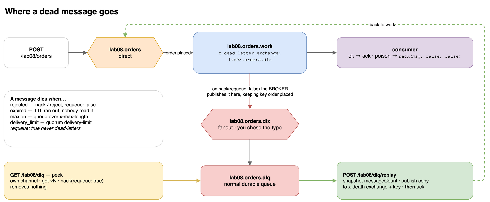
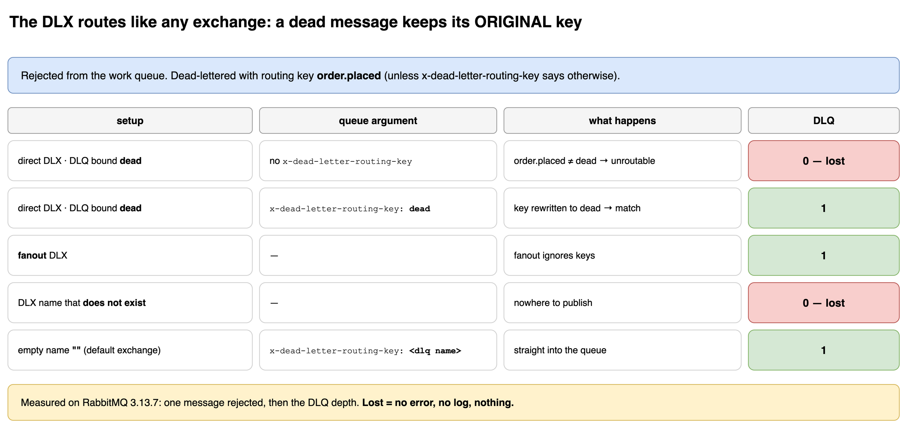
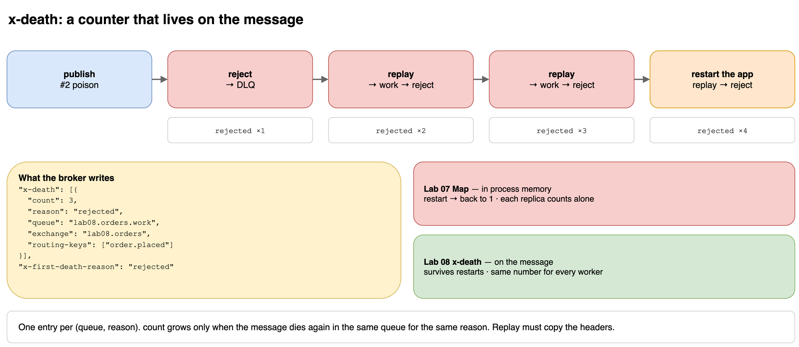

# Lab 08 — Dead Letter Exchange

## Goal
In Lab 07, `nack(msg, false, false)` **deleted** the message. Here the consumer makes the exact same call, and the message is **kept**.

The difference is one queue argument, not consumer code:

```ts
await channel.assertQueue('lab08.orders.work', {
  durable: true,
  arguments: { 'x-dead-letter-exchange': 'lab08.orders.dlx' },
});
```

"When a message dies in this queue, publish it to this exchange instead of deleting it."

- **DLX** (dead letter exchange): a normal exchange. You create it, you pick its type.
- **DLQ** (dead letter queue): a normal queue bound to the DLX.

## When does a message die?

| `reason` in `x-death` | cause |
|-----------------------|-------|
| `rejected` | `nack` / `reject` with `requeue: false` |
| `expired` | its TTL ran out before anyone consumed it |
| `maxlen` | the queue went over `x-max-length` |
| `delivery_limit` | a quorum queue went over `delivery-limit` |

`requeue: true` never dead-letters. The message simply goes back into the queue (Lab 07).

## The DLX is just a name

`x-dead-letter-exchange` holds a **name**. It does not create the exchange and does not imply a type.

| question | answer |
|----------|--------|
| default type? | none. RabbitMQ does not create the DLX for you |
| must match the main exchange's type? | no. Here the main one is `direct`, the DLX is `fanout` |
| DLX does not exist when a message dies? | the message is **dropped**, silently |
| which routing key? | the message's **original** key, unless `x-dead-letter-routing-key` is set |

| DLX type | use it when |
|----------|-------------|
| `fanout` | one DLQ for everything. Routing keys cannot break it (this lab) |
| `direct` + `x-dead-letter-routing-key` | you want one explicit key for all dead letters |
| `topic` | one DLX for many queues, split by domain (`order.#`, `payment.#`) |
| `''` (default exchange) + `x-dead-letter-routing-key: <dlq name>` | straight into a queue, no exchange to create |

Measured: one message rejected from a work queue, then the DLQ depth.

| setup | DLQ |
|-------|-----|
| `direct` DLX, DLQ bound `dead`, no `x-dead-letter-routing-key` | **0** — lost |
| `direct` DLX, DLQ bound `dead`, `x-dead-letter-routing-key: dead` | 1 |
| `fanout` DLX | 1 |
| DLX name that does not exist | **0** — lost |
| `''` + `x-dead-letter-routing-key: <dlq name>` | 1 |

## Flow
```text
POST /lab08/orders          direct                          work queue
  {kind:"poison"}  ──►  lab08.orders ──order.placed──►  lab08.orders.work   (x-dead-letter-exchange)
                                                               │ nack(requeue: false)
                                                               ▼
                                                   fanout   lab08.orders.dlx
                                                               │
                                                               ▼
                                                        lab08.orders.dlq  ◄── GET  /lab08/dlq          peek
                                                               └────────────► POST /lab08/dlq/replay   back to work
```

## `x-death`: the counter Lab 07 was missing
Every time a message dies, the **broker** adds or updates this header:

```json
"x-death": [{
  "count": 3,
  "reason": "rejected",
  "queue": "lab08.orders.work",
  "exchange": "lab08.orders",
  "routing-keys": ["order.placed"]
}],
"x-first-death-reason": "rejected",
"x-first-death-queue": "lab08.orders.work"
```

It travels **with the message**: it survives an app restart and every worker sees the same number. One entry per `(queue, reason)`; `count` grows when the message dies again in the same queue for the same reason.

amqplib 2.x types it as `XDeath[]` already, so `msg.properties.headers?.['x-death'] ?? []` needs no cast.

## Run
```bash
CONSUMERS=on npm run start:dev

curl -X POST localhost:3000/lab08/orders -H 'Content-Type: application/json' -d '{"kind":"poison"}'
curl localhost:3000/lab08/dlq                 # peek, removes nothing
curl -X POST localhost:3000/lab08/dlq/replay  # move the DLQ back to the work exchange
```

| Env | Default | Meaning |
|-----|---------|---------|
| `LAB08_PAUSED` | off | `on` = declare everything, never consume (lets messages expire) |
| `LAB08_DELAY` | `300` | simulated work time in ms |

| Body field | Meaning |
|------------|---------|
| `kind` | `ok` (acked) · `poison` (rejected) |
| `count` | how many to publish |
| `expiresInMs` | per-message TTL (`expiration` property) |

## Experiments (measured on RabbitMQ 3.13.7)

| # | do | result |
|---|----|--------|
| A | publish `ok` | `✅ #1 done`, DLQ empty |
| B | publish `poison`, then peek | DLQ 1 · `rejected from lab08.orders.work ×1 (key: order.placed)` · peek removed nothing |
| C | replay, replay | `(died before: rejected ×1)` → `(… ×2)` → peek shows **×3** |
| D | **restart the app**, replay | `(died before: rejected ×3)`: the count survived |
| E | `LAB08_PAUSED=on`, publish 2 × `ok` with `expiresInMs: 3000`, wait 4 s | work 0 · DLQ 2 · reason **`expired`**. Healthy messages in the DLQ |
| F | policy on Lab 07's queue (below), `LAB07_STRATEGY=drop`, publish poison | Lab 07 logs `🗑️ dropped`, but the message is in `lab08.orders.dlq` |

### Experiment F: a DLX without touching code
`lab07.payments` already exists without a DLX. Redeclaring it with a new argument → `PRECONDITION_FAILED`. A **policy** changes it from the outside:

```bash
docker exec rabbitmq rabbitmqctl set_policy lab07-dlx '^lab07\.payments$' \
  '{"dead-letter-exchange":"lab08.orders.dlx"}' --apply-to queues

# …run the experiment…

docker exec rabbitmq rabbitmqctl clear_policy lab07-dlx
```

```text
Lab07: 🗑️  #1 dropped                                   ← the consumer thinks it deleted it
DLQ:   {"paymentId":1,"kind":"poison","amount":99}
       rejected from lab07.payments ×1 (key: payment.requested)
```

Policies are what production uses: DLX, TTL and length limits can be changed on live queues without redeploying or recreating them.

## Peek and replay
`channel.get()` pulls **one** message (or `false` when empty). Too slow for normal consuming, right for admin tools.

- **Own channel.** `get` on a queue that does not exist closes the channel with 404. It must not be the shared publishing channel.
- **Peek** takes up to 50 messages without acking, then `nack(requeue: true)` puts every one back.
- **Replay** snapshots `messageCount` first. A poison message replayed now dies again and lands back in the DLQ while the loop is still running; "until empty" would loop forever.
- **Publish first, ack second.** Crash in between → a duplicate. The other order → a loss.
- Headers are copied, so `x-death` keeps counting.

## Key Takeaways
- Dead-lettering is configured on the **queue**, not in the consumer. The same `nack(requeue: false)` deletes or keeps depending on one argument or policy.
- The DLX is an ordinary exchange with ordinary routing. If no binding matches the dead message's routing key, it is lost.
- `x-death` is a broker-side counter that survives restarts and is shared by every worker. It replaces Lab 07's in-memory `Map`.
- The DLQ is not "broken messages". It is "messages that died": `rejected` (message or bug), `expired` (the system was slow), `maxlen` (the system was full). Read `x-first-death-reason` before acting.
- Replay is a publish. It needs the same care: publisher confirms (Lab 11) and idempotent consumers (Lab 12).

## Gotchas
- **Routing key trap:** a `direct` DLX with the DLQ bound as `dead` receives nothing. Dead letters keep `order.placed`. Use `fanout`, set `x-dead-letter-routing-key`, or bind the original key.
- **Missing DLX:** declare the DLX before the work queue. A queue pointing at a name that does not exist drops its dead letters.
- **Arguments are fixed:** adding `x-dead-letter-exchange` to an existing queue → `PRECONDITION_FAILED`. Use a policy.
- **A DLQ has no limit by default.** Nobody reads it, it grows forever. Alert on its depth.
- **Replay without confirms** can still lose the message: `publish()` returns before the broker has it, and the original is acked right after.
- **Stale replays:** an `expired` order replayed an hour later may no longer be valid. TTL often means "no longer relevant".
- **Classic-queue TTL only expires at the head.** A long TTL message in front blocks shorter ones behind it → Lab 09.

## Mental Model
```text
x-dead-letter-exchange = "where do my dead go"       (a name, on the queue)
DLX                    = an ordinary exchange          (you choose the type)
DLQ                    = an ordinary queue             (you decide who reads it)
x-death                = the death certificate         (why, where, how many times)
```

## Diagrams



